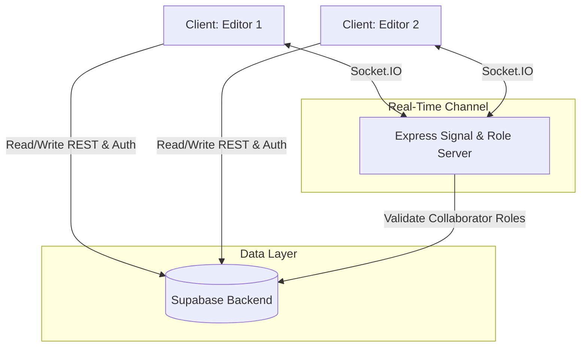

# 🎨 Lumineon — Collaborative Whiteboard

A high-performance, real-time collaborative canvas designed for technical brainstorming, system design, and lightning-fast prototyping. Built with **React 19**, **Vite**, **Express**, **Socket.IO**, and **Supabase**, this project implements an infinite vector canvas powered by **Tldraw** with sub-millisecond sync latency, role-based access control, and auto-persisting state.

---

<div className="flex gap-2 mb-6">
  
  
  
  
</div>

<Callout type="info" title="Aesthetics & Performance First">
  Designed with a premium glassmorphic interface, soft micro-animations, and low-latency canvas merges, Lumineon gives your engineering and product teams a zero-friction playground to model ideas.
</Callout>

---

## 🚀 Key Features

*   **Sub-millisecond Real-Time Sync**: Experience peer-to-peer speeds ensuring your team sees every stroke, node connection, and text block the exact millisecond it is created.
*   **Infinite Vector Canvas**: Zoom from a single micro-routine to massive multi-service infrastructure without losing crispness, powered by `@tldraw/tldraw`.
*   **Granular Access Control**: Share view-only links with stakeholders while retaining full edit rights for the core team (`owner`, `editor`, `viewer`).
*   **Persisted Workspaces**: Whiteboard states automatically save to Supabase Database using a debounced queue system, ensuring zero loss of breakthrough ideas.
*   **Live Collaborator Indicators**: Dynamic toast alerts when collaborators join or leave rooms, and visual update indicators when modifications happen.

---

## 🗺️ System Architecture



---

## 📂 Project Structure

```bash
collaborative-editor/
├── client/                     # Frontend Vite + React application
│   ├── src/
│   │   ├── assets/             # Brand and background graphics
│   │   ├── components/         # Reusable UI components
│   │   │   ├── AuthForm.jsx    # Glassmorphic Sign In / Sign Up form
│   │   │   ├── BoardUpdateCard.jsx # Collaboration update tracker UI
│   │   │   └── ProtectedRoute.jsx # Route guard checks
│   │   ├── context/
│   │   │   └── AuthContext.jsx # Supabase session context state
│   │   ├── data/
│   │   │   └── landingPageData.js # Static copywriting & lists
│   │   ├── hooks/
│   │   │   └── useWhiteboardSync.js # Canvas Socket.IO merge handler hook
│   │   ├── lib/
│   │   │   ├── socket.js       # Client Socket.IO connection manager
│   │   │   └── supabaseClient.js # Client Supabase SDK configuration
│   │   ├── pages/
│   │   │   ├── Dashboard.jsx   # Workspace board listing & options manager
│   │   │   ├── LandingPage.jsx # Product intro and feature highlight page
│   │   │   ├── Login.jsx       # Authentication Entry (Sign In)
│   │   │   ├── SignUp.jsx      # Authentication Entry (Sign Up)
│   │   │   └── Whiteboard.jsx  # Interactive Room Layout page
│   │   ├── utils/
│   │   │   ├── saveBoard.js    # Debounced storage auto-saver utility
│   │   │   └── getName.js      # Extract user names from email identifiers
│   │   ├── index.css           # Styling configuration (Tailwind V4 directives)
│   │   └── router.jsx          # Route paths mapping
│   ├── package.json
│   └── vite.config.js
│
└── server/                     # Backend Signal Server
    ├── config/
    │   └── supabaseClient.js   # Supabase Admin SDK Client initialization
    ├── db/
    │   └── collaborators.js    # DB accessor methods for roles
    ├── middlewares/
    │   └── boardAccess.js      # HTTP request access control middleware
    ├── routes/
    │   └── boardRoutes.js      # REST resource routes (access verification)
    ├── utils/
    │   ├── genRandomColor.js   # Hexadecimal color generator
    │   └── getUserData.js      # Find user attributes inside active rooms
    ├── server.js               # Entry point (Server logic & Socket events)
    └── package.json
```

---

## 🛠️ Installation & Setup

### Prerequisites
- Node.js (v18 or higher)
- NPM or PNPM
- A Supabase Project instance

### 1. Clone the Repository
```bash
git clone https://github.com/1304-PK/collaborative-editor.git
cd collaborative-editor
```

### 2. Configure Environment Variables

Create `.env` files in both frontend and backend projects:

#### Client Configuration (`client/.env`)
```env
VITE_SUPABASE_URL=https://your-supabase-url.supabase.co
VITE_SUPABASE_ANON_KEY=your-supabase-anon-key
```

#### Server Configuration (`server/.env`)
```env
PORT=3000
SUPABASE_URL=https://your-supabase-url.supabase.co
SUPABASE_SERVICE_ROLE_KEY=your-supabase-service-role-key
```

### 3. Install and Run the Server
```bash
cd server
npm install
npm start
```
*Runs the Express server at `http://localhost:3000` with Node hot-reload watch.*

### 4. Install and Run the Client
```bash
cd ../client
npm install
npm run dev
```
*Launches the Vite Dev Server at `http://localhost:5173`.*

---

## 🔌 API & Socket Specifications

### REST Endpoints (Express Server)

| Endpoint | Method | Authorization | Description |
| :--- | :--- | :--- | :--- |
| `/api/board/access/:boardId` | `GET` | Bearer Token (Authorization Header) | Resolves collaborator credentials, role status, and returns the board's title and canvas snapshot. |

### Socket.IO Connections & Events

```js
// Handshake authentication credentials structure:
const socket = io("http://localhost:3000", {
  auth: {
    token: session.access_token,
    boardId: boardId
  }
});
```

<details>
  <summary>🔍 Expand Socket Event Definitions</summary>

  - **`join-room`**: Emitted by client on successful connection. Stores email, user ID, and assigns a random cursor color.
  - **`user-connected`**: Emitted by server to all other clients when a user enters the board. Triggering custom notifications.
  - **`whiteboard-update`**: Emitted by clients with role permissions (`owner` or `editor`). Contains local changes delta.
  - **`whiteboard-sync`**: Emitted by server. Contains remote board delta changes. Updates local canvas state using Tldraw merge utility.
  - **`user-disconnect`**: Notifies other socket clients when a developer leaves the room.
</details>

---

## 💻 Technical Implementation Details

### Debounced Saving Logic (`client/src/utils/saveBoard.js`)
To avoid overloading Supabase DB with every mouse move, updates are throttled using a 1-second timeout loop.

```javascript
let saveTimeout = null;

const saveBoard = (editor, boardId, setSaveStatus) => {
  clearTimeout(saveTimeout);
  setSaveStatus(true);
  
  saveTimeout = setTimeout(async () => {
    const snapshot = JSON.stringify(editor.getSnapshot());
    await supabase
      .from("whiteboards")
      .update({ canvas_data: snapshot })
      .eq('id', boardId);
      
    setSaveStatus(false);
  }, 1000);
};
```

---

## 🤝 Contribution Guidelines

We welcome community contributions! Please adhere to the following steps:
1. Fork the project.
2. Create a feature branch (`git checkout -b feature/AmazingFeature`).
3. Commit your changes (`git commit -m 'Add some AmazingFeature'`).
4. Push to the branch (`git push origin feature/AmazingFeature`).
5. Open a Pull Request.

---

## 📄 License

Distributed under the ISC License. See `LICENSE` for more information.
